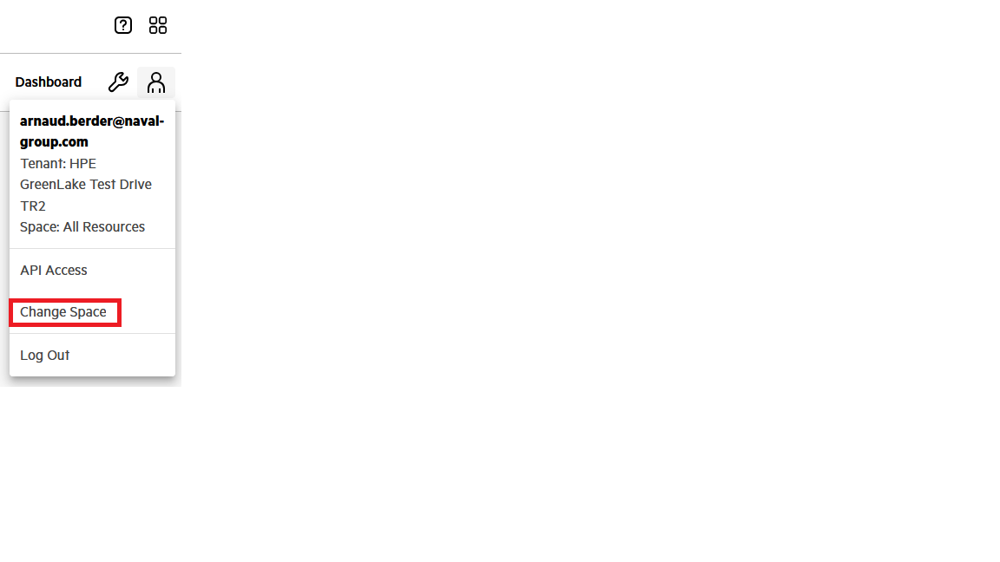
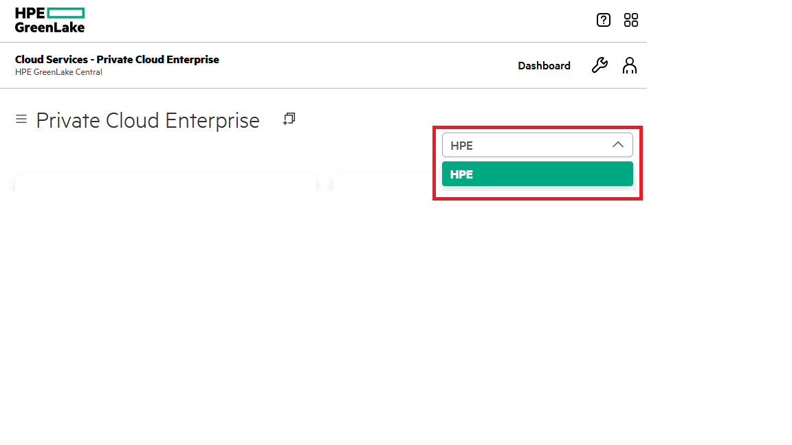
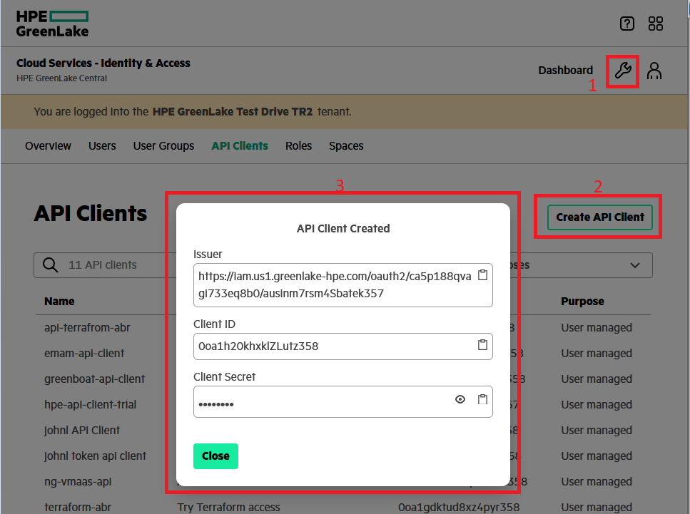
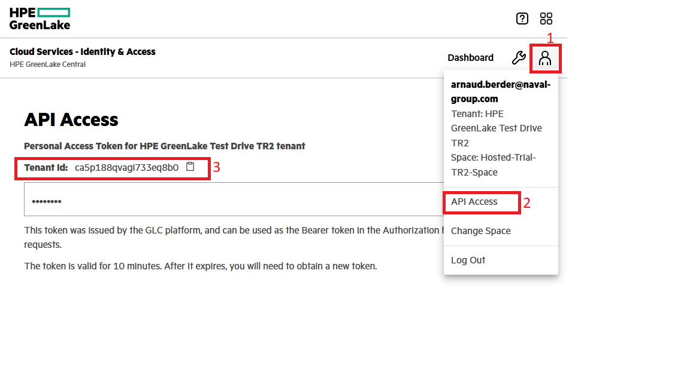

# Utilisation de Terraform sur Cloud PCE
## Installation du provider HPEGL
Howto d'installation et utilisation disponible ici: [Terraform/HPEGL provider](https://github.com/HPE/terraform-provider-hpegl)

## Configuration du provider
L'appel du provider Terraform doit ressembler à ceci:
```
 terraform {
  required_providers {
    hpegl = {
      source  = "hpe/hpegl"
      version = "0.4.15"
    }
  }
}
```
Il est ensuite nécessaire de déclarer l'environnement de travail sur le Cloud PCE. Pour cela ajouter le code suivant dans votre fichier terraform:
```
# Environnement du provider
provider "hpegl" {
  vmaas {
    location   = "HPE"
    space_name = "Hosted-Trial-TR2-Space"
  }
}
```
Ou trouver les informations Location et Space_Name ?
Ces informations sont disponibles depuis l'interface WEB de PCE. Se connecter à l'interface puis cliquer sur son profil:



L'écran suivant affiche les espaces disponibles selon votre profil et donc le contenu de la variable: space_name !

Pour trouver le contenu de la variable Location, il suffit de se connecter sur la page d'accueil et de faire dérouler le menu en haut à droite:



Vous êtes prêt à tester la connexion ... mais pas sans s'être authentifié avant !

Pour cela il faut générer un token.

## Générer son Token
Pour générer un token, il faut se rendre sur la page: Identity & Access. Cette page est accessible en cliquant sur la "clé plate de 8" en haut à droite de votre profil--> User Management.

Choisir ensuite le menu "API Clients" et créer une nouvelle clé avec "Create API Client". Donner un nom et une description à votre clé et surtout SURTOUT enregister bien toutes les informations qui s'affichent (le champ client secret n'est plus disponible par la suite !!):



## Récupérer l'ID du Tenant
Le Token permet de s'identifier sur PCE, mais il faut également savoir sur quel tenant déployer ses ressources. Le Tenant est identifié par un ID qui est disponible sur la page API Access. Pour accèder à cette information, il suffit de cliquer sur son profil et choisir le menu API Access. La page suivante affiche l'ID du tenant:

)


## Passer les informations de Token en variable d'environnement
Les variables à déclarer sont les suivantes:
```
export HPEGL_TENANT_ID=<Your Tenant ID>
export HPEGL_USER_ID=<Client ID of the API Client>
export HPEGL_USER_SECRET=<Secret Key displayed when you created the API Client>
export HPEGL_IAM_SERVICE_URL=<Issuer URL>
```
## Tester la connexion
Pour tester la connexion, depuis votre serveur disposant de Terraform, utiliser la commande:
```
$ terraform init
$ terraform plan
```
# Script terraform
le fichier data.tf contient les informations permettant de récupérer les ID nécessaires au déploiement d'une ou plusieurs instances.

Le fichier vars.tf contient des informations de sizing des environnements à déployer.

Le fichier main.tf décrit le déploiement d'une ou plusieurs instances.

Les fichiers vars et main sont à personnaliser selon vos besoins et sont données à titre d'exemples.

